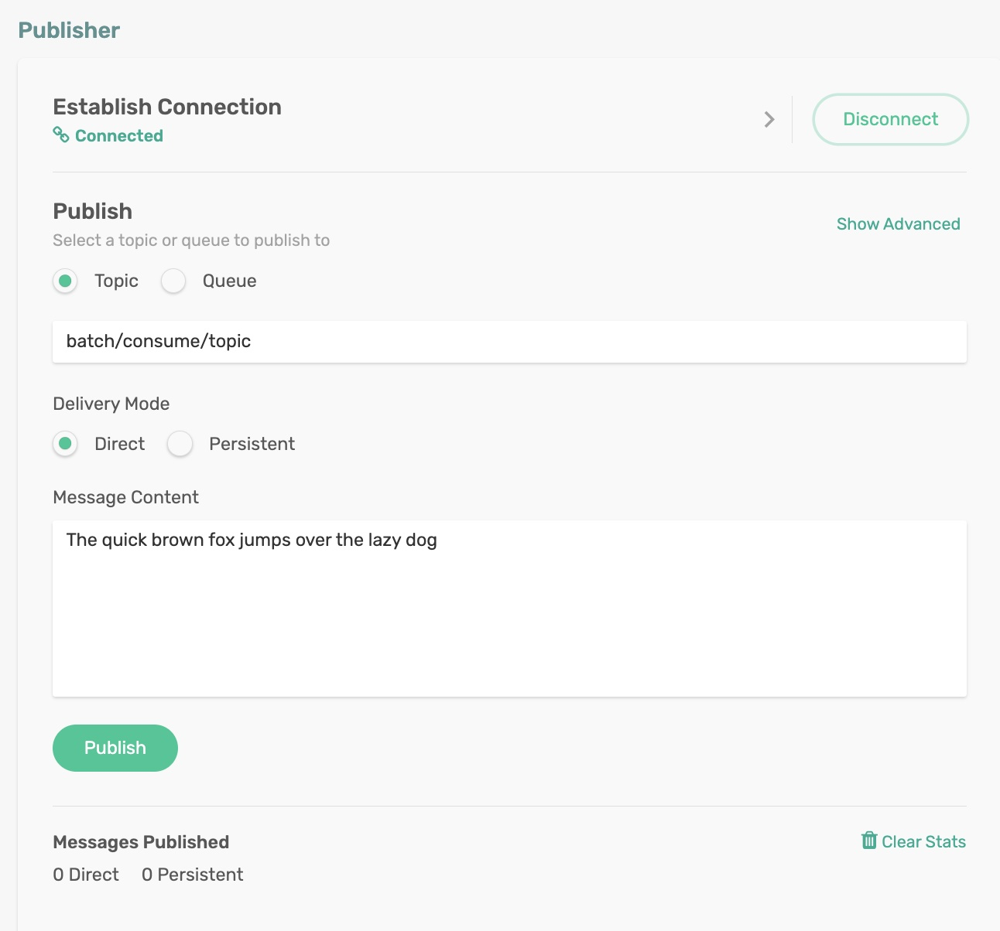

# Batch Consumers

Batch consumers handle a large number of messages as a batch. It can process data quickly, minimize or eliminate the need for multiple round-trips, and improve the efficiency of message processing. It can be ideal for bulk processing involving high-volume activities such as managing database updates, sensor data, etc.

A batch that the binder creates is a collection of individual messages and must not be treated as a single consistent unit. Batch consumers can be enabled by setting spring.cloud.stream.bindings.<binding-name>.consumer.batch-mode to true. 

## Requirements

To run this sample, you will need to have installed:

Java 8 or Above

## Code Tour

In the BatchConsumer application, review the consumer code.

```
Consumer<Message<List<byte[]>>> batchConsume() {
    return batchMsg -> { // (1)
        List<?> data = batchMsg.getPayload();
        MessageHeaders headers = batchMsg.getHeaders();
        List<?> dataHeaders = (List<?>) headers.get(SolaceBinderHeaders.BATCHED_HEADERS);

        log.info("Batch Size: " + data.size());
        for (int i=0; i< data.size(); i++) {
            log.info("Batch Headers: " + dataHeaders.get(i));
            log.info("Batch Payload: " + new String((byte[]) data.get(i), StandardCharsets.UTF_8));
        }
    };
}
```

- Notice that the batch of messages (1 or more) comes in as a single Spring message `Message<List<byte[]>>`
- The Spring Message's header contains a list of headers; we will extract them as a list and traverse the list to get access to individual message headers
```
MessageHeaders headers = batchMsg.getHeaders();
List<?> dataHeaders = (List<?>) headers.get(SolaceBinderHeaders.BATCHED_HEADERS);
```
- The Spring Message's payload contains a list of payloads; we will extract them as a list and traverse the list to get access to individual message payloads
```
List<?> data = batchMsg.getPayload();
for (int i=0; i< data.size(); i++) {
    log.info("Batch Payload: " + new String((byte[]) data.get(i), StandardCharsets.UTF_8));
}
```

Batching is a consumer side feature, and the publisher has no concern or participation. For example, suppose a batched consumer reconnects to a queue with several enqueued messages. In that case, the binder will automatically collect them as batches and deliver them to the `Consumer` function.

## Running the application

Make sure to update the Solace Broker connection details with the appropriate host, msgVpn, client username, and password in `spring.cloud.stream.binders.solace-broker.environment` settings.

```
cd batch-consumers
mvn clean spring-boot:run
```
This will start the Spring Boot application.

You can see the Spring Boot application has created a non-exclusive queue `scst/wk/batch/plain/batch/consume/topic` with topic subscription `batch/consume/topic`


### Publish Messages
Publish messages (as many as you can) to the topic `batch/consume/topic` either programmatically or using the Publisher tool in the `Try Me!` utility of the Solace Broker console. 
- Enter some string (say _Hello World_) in the *Message Content*
- Click on publish (again, and again say ten messages)

<p align="center"></p>

In the terminal, you can see the first batch delivered nine messages, followed by a batch with the rest of the messages.
```
Batch Size: 9
Batch Headers: {solace_senderTimestamp=1657689247631, solace_expiration=0, solace_replicationGroupMessageId=rmid1:0ed98-83a990d24ba-00000000-0000502c, solace_destination=batch/consume/topic, solace_isReply=false, solace_timeToLive=0, solace_receiveTimestamp=0, solace_discardIndication=false, solace_dmqEligible=false, solace_priority=-1, solace_redelivered=false, id=e71ffdbd-e04c-155d-57d0-033e8ea67615, solace_senderId=Try-Me-Pub/solclientjs/chrome-103.0.5060-OSX-10.15.7/0970184284/0006, timestamp=1657689249315}
Batch Payload: The quick brown fox jumps over the lazy dog
Batch Headers: {solace_senderTimestamp=1657689247859, solace_expiration=0, solace_replicationGroupMessageId=rmid1:0ed98-83a990d24ba-00000000-0000502d, solace_destination=batch/consume/topic, solace_isReply=false, solace_timeToLive=0, solace_receiveTimestamp=0, solace_discardIndication=false, solace_dmqEligible=false, solace_priority=-1, solace_redelivered=false, id=584c4f2a-a54b-927a-d3c9-d70d20348bb6, solace_senderId=Try-Me-Pub/solclientjs/chrome-103.0.5060-OSX-10.15.7/0970184284/0006, timestamp=1657689249316}
Batch Payload: The quick brown fox jumps over the lazy dog
Batch Headers: {solace_senderTimestamp=1657689248092, solace_expiration=0, solace_replicationGroupMessageId=rmid1:0ed98-83a990d24ba-00000000-0000502e, solace_destination=batch/consume/topic, solace_isReply=false, solace_timeToLive=0, solace_receiveTimestamp=0, solace_discardIndication=false, solace_dmqEligible=false, solace_priority=-1, solace_redelivered=false, id=3966bed4-c870-dc60-33dc-c6b418fed7ff, solace_senderId=Try-Me-Pub/solclientjs/chrome-103.0.5060-OSX-10.15.7/0970184284/0006, timestamp=1657689249316}
Batch Payload: The quick brown fox jumps over the lazy dog
Batch Headers: {solace_senderTimestamp=1657689248191, solace_expiration=0, solace_replicationGroupMessageId=rmid1:0ed98-83a990d24ba-00000000-0000502f, solace_destination=batch/consume/topic, solace_isReply=false, solace_timeToLive=0, solace_receiveTimestamp=0, solace_discardIndication=false, solace_dmqEligible=false, solace_priority=-1, solace_redelivered=false, id=005f0348-2cf9-21b0-fec2-a655e3f650bd, solace_senderId=Try-Me-Pub/solclientjs/chrome-103.0.5060-OSX-10.15.7/0970184284/0006, timestamp=1657689249316}
Batch Payload: The quick brown fox jumps over the lazy dog
Batch Headers: {solace_senderTimestamp=1657689248358, solace_expiration=0, solace_replicationGroupMessageId=rmid1:0ed98-83a990d24ba-00000000-00005030, solace_destination=batch/consume/topic, solace_isReply=false, solace_timeToLive=0, solace_receiveTimestamp=0, solace_discardIndication=false, solace_dmqEligible=false, solace_priority=-1, solace_redelivered=false, id=0b932bc6-cd7c-bb31-3bf9-99f62534587c, solace_senderId=Try-Me-Pub/solclientjs/chrome-103.0.5060-OSX-10.15.7/0970184284/0006, timestamp=1657689249317}
Batch Payload: The quick brown fox jumps over the lazy dog
Batch Headers: {solace_senderTimestamp=1657689248425, solace_expiration=0, solace_replicationGroupMessageId=rmid1:0ed98-83a990d24ba-00000000-00005031, solace_destination=batch/consume/topic, solace_isReply=false, solace_timeToLive=0, solace_receiveTimestamp=0, solace_discardIndication=false, solace_dmqEligible=false, solace_priority=-1, solace_redelivered=false, id=19c27db0-38bd-ece1-f8a5-ae3f35a1e383, solace_senderId=Try-Me-Pub/solclientjs/chrome-103.0.5060-OSX-10.15.7/0970184284/0006, timestamp=1657689249317}
Batch Payload: The quick brown fox jumps over the lazy dog
Batch Headers: {solace_senderTimestamp=1657689248627, solace_expiration=0, solace_replicationGroupMessageId=rmid1:0ed98-83a990d24ba-00000000-00005032, solace_destination=batch/consume/topic, solace_isReply=false, solace_timeToLive=0, solace_receiveTimestamp=0, solace_discardIndication=false, solace_dmqEligible=false, solace_priority=-1, solace_redelivered=false, id=ce97d58c-0ec4-804a-c798-be709c81b687, solace_senderId=Try-Me-Pub/solclientjs/chrome-103.0.5060-OSX-10.15.7/0970184284/0006, timestamp=1657689249317}
Batch Payload: The quick brown fox jumps over the lazy dog
Batch Headers: {solace_senderTimestamp=1657689249140, solace_expiration=0, solace_replicationGroupMessageId=rmid1:0ed98-83a990d24ba-00000000-00005033, solace_destination=batch/consume/topic, solace_isReply=false, solace_timeToLive=0, solace_receiveTimestamp=0, solace_discardIndication=false, solace_dmqEligible=false, solace_priority=-1, solace_redelivered=false, id=34c4b7ca-8551-5b10-3c56-a22f9ac358d7, solace_senderId=Try-Me-Pub/solclientjs/chrome-103.0.5060-OSX-10.15.7/0970184284/0006, timestamp=1657689249318}
Batch Payload: The quick brown fox jumps over the lazy dog
Batch Headers: {solace_senderTimestamp=1657689249295, solace_expiration=0, solace_replicationGroupMessageId=rmid1:0ed98-83a990d24ba-00000000-00005034, solace_destination=batch/consume/topic, solace_isReply=false, solace_timeToLive=0, solace_receiveTimestamp=0, solace_discardIndication=false, solace_dmqEligible=false, solace_priority=-1, solace_redelivered=false, id=35a4a0b0-e69a-59ff-7034-0920a122b674, solace_senderId=Try-Me-Pub/solclientjs/chrome-103.0.5060-OSX-10.15.7/0970184284/0006, timestamp=1657689249318}
Batch Payload: The quick brown fox jumps over the lazy dog
Batch Size: 1
Batch Headers: {solace_senderTimestamp=1657689250011, solace_expiration=0, solace_replicationGroupMessageId=rmid1:0ed98-83a990d24ba-00000000-00005035, solace_destination=batch/consume/topic, solace_isReply=false, solace_timeToLive=0, solace_receiveTimestamp=0, solace_discardIndication=false, solace_dmqEligible=false, solace_priority=-1, solace_redelivered=false, id=e70d2939-cd20-2e7b-2a01-7cc986c9cb42, solace_senderId=Try-Me-Pub/solclientjs/chrome-103.0.5060-OSX-10.15.7/0970184284/0006, timestamp=1657689255020}
Batch Payload: The quick brown fox jumps over the lazy dog
```

To create a batch of messages, the binder will consume messages from the PubSub+ broker until either a maximum batch size or timeout has been achieved. Afterward, the binder will compose the batch message and send it to the consumer handler for processing. Both these batching parameters can be configured using the `batchMaxSize` and `batchTimeout` consumer config options.


🔥 Yes, Now you can consume messages in batches without tweaking publishers! 🔥