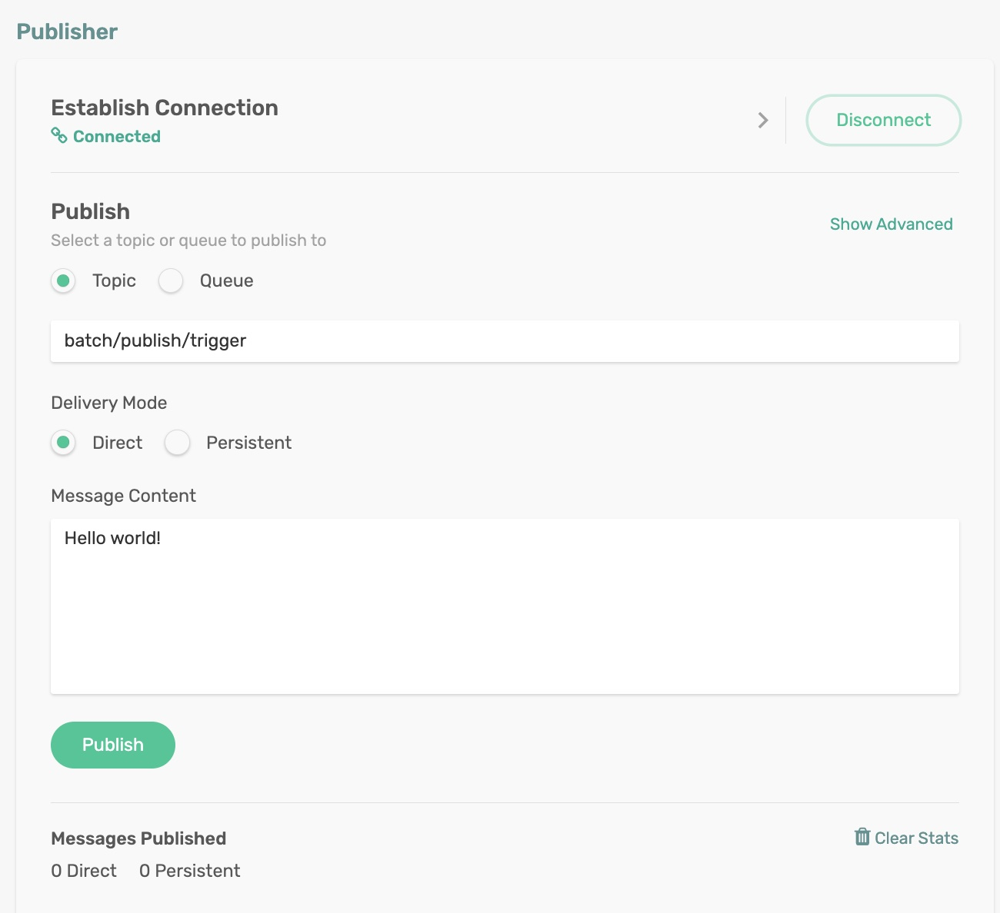

# Batch Publishers

Batch Publishers publish messages in batches. A batch of messages is just a single Spring Message whose payload is a list of individual message payloads.
Batch publishing does not require any additional configuration – it is just how the messages are bundled and published as a collection.

## Requirements

To run this sample, you will need to have installed:

Java 8 or Above

## Code Tour

In the BatchPublisher application, review the function code.

```
@Bean
public Function<String, Collection<Message<String>>> batchPublish() {
    return v -> {
        System.out.println("Received trigger to publish Array of Messages");
        
        ArrayList<Message<String>> msgList = new ArrayList<Message<String>>();
        msgList.add(MessageBuilder.withPayload("Payload 1").build());
        msgList.add(MessageBuilder.withPayload("Payload 2").build());
        msgList.add(MessageBuilder.withPayload("Payload 3").build());
        msgList.add(MessageBuilder.withPayload("Payload 4").build());
        msgList.add(MessageBuilder.withPayload("Payload 5").build());
        
        System.out.println("Publish Array of 5 Messages");
        return msgList;
    };
}

```

It is possible to publish each message to a different destination by setting the target destination dynamically.

```
@Bean
public Function<String, Collection<Message<String>>> batchPublish() {
    return v -> {
        System.out.println("Received trigger to publish Array of Messages");
        
        ArrayList<Message<String>> msgList = new ArrayList<Message<String>>();
        msgList.add(MessageBuilder.withPayload("Payload 1").setHeader(BinderHeaders.TARGET_DESTINATION, "batch/consume/topic/1").build());
        msgList.add(MessageBuilder.withPayload("Payload 2").setHeader(BinderHeaders.TARGET_DESTINATION, "batch/consume/topic/2").build());
        msgList.add(MessageBuilder.withPayload("Payload 3").setHeader(BinderHeaders.TARGET_DESTINATION, "batch/consume/topic/3").build());
        msgList.add(MessageBuilder.withPayload("Payload 4").setHeader(BinderHeaders.TARGET_DESTINATION, "batch/consume/topic/4").build());
        msgList.add(MessageBuilder.withPayload("Payload 5").setHeader(BinderHeaders.TARGET_DESTINATION, "batch/consume/topic/4").build());
        
        System.out.println("Publish Array of 5 Messages");
        return msgList;
    };
}

```

Upon receiving the trigger message on the topic `batch/publish/trigger`, the function builds a list of messages and publish it as a collection.

## Running the application

Make sure to update the Solace Broker connection details with the appropriate host, msgVpn, client username, and password in `spring.cloud.stream.binders.solace-broker.environment` settings.

```
cd batch-publishers
mvn clean spring-boot:run
```
This will start the Spring Boot application.

### Publish Messages
Publish the trigger message on the topic `batch/publish/trigger` programmatically or using the Publisher tool in the `Try Me!` utility of the Solace Broker console. 

<p align="center"></p>


In the terminal, you can see the batch publish in action.
```
Received trigger to publish Array of Messages
Publish Array of 5 Messages
```

You can verify the publish by subscribing to topic `batch/consume/topic` either in the Subscriber tool in the `TryMe` utility of the Solace Broker console or by running the [Batch Consumer](https://github.com/solacecommunity/solace-spring-cloud-stream-binder-features/tree/main/batch-consumers) application.

🔥 Yes, Now you can publish messages in batches easily! 🔥