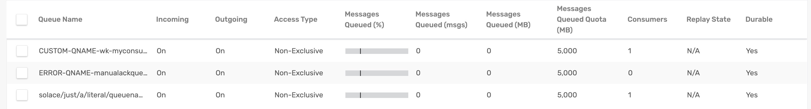
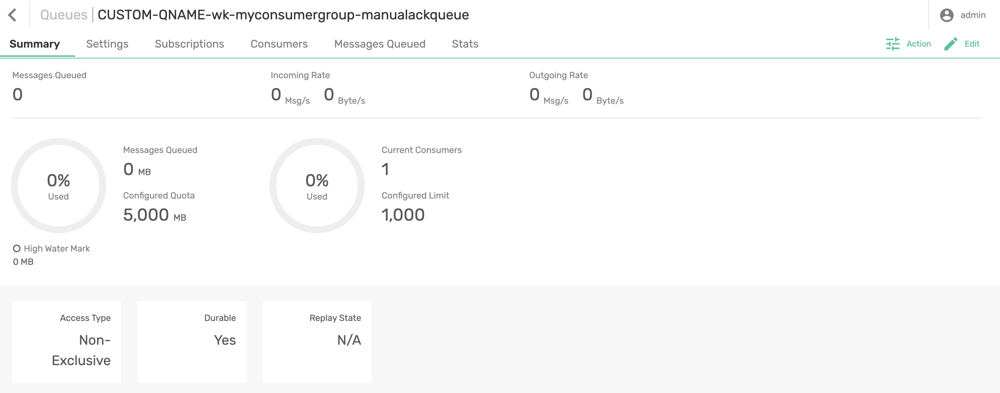
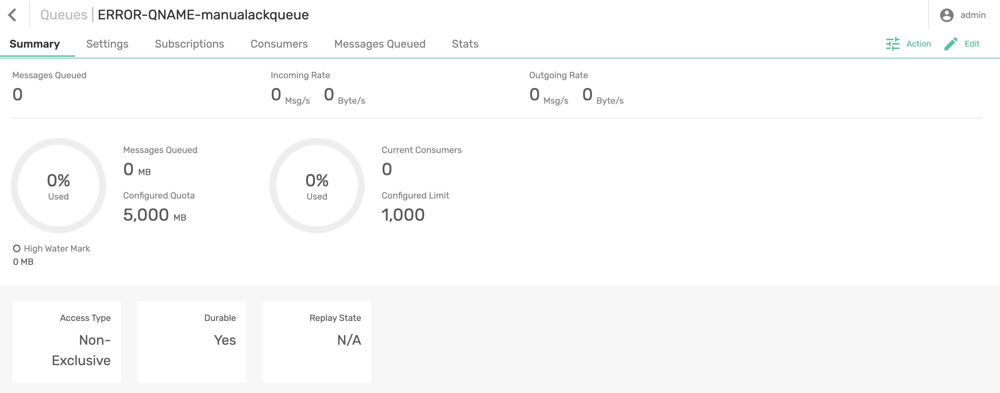

# Generated Queue & Error Queue Names

This Spring Cloud Stream sample will show how to generate custom names for queues and error queues using Spring configuration. We will also examine the attributes from [SolaceCommonProperties](https://github.com/SolaceProducts/solace-spring-cloud/blob/master/solace-spring-cloud-stream-binder/solace-spring-cloud-stream-binder-core/src/main/java/com/solace/spring/cloud/stream/binder/properties/SolaceCommonProperties.java) and [SolaceConsumerProperties](https://github.com/SolaceProducts/solace-spring-cloud/blob/master/solace-spring-cloud-stream-binder/solace-spring-cloud-stream-binder-core/src/main/java/com/solace/spring/cloud/stream/binder/properties/SolaceConsumerProperties.java) that helps in the name generation.

## Requirements

To run this sample, you will need to have installed:

Java 8 or Above

## Custom Queue & Error Queue names

Solace binder supports custom names for queues and error queues using `queueNameExpression` and `errorQueueNameExpression` properties. 

The `queueNameExpression` and `errorQueueNameExpression` follow [SpEL](https://docs.spring.io/spring-framework/docs/4.3.12.RELEASE/spring-framework-reference/html/expressions.html) expression. Users can provide any valid SpEL expression to generate custom queue names. Valid expressions evaluate against the following context:

The default SpEL expression for creating the consumer group’s queue name is here.
```
(properties.solace.queueNamePrefix?.trim()?.length() > 0 ? 
    properties.solace.queueNamePrefix.trim() + '/' : '') + 
(properties.solace.useFamiliarityInQueueName ? 
    (isAnonymous ? 'an' : 'wk') + '/' : '') + 
(isAnonymous ? group?.trim() + '/' : 
    (properties.solace.useGroupNameInQueueName ? 
        group?.trim() + '/' : '')) + 
(properties.solace.useDestinationEncodingInQueueName ? 
        'plain' + '/' : '') + 
destination.trim().replaceAll('[*>]', '_')
```


## Running the application

Make sure to update the Solace Broker connection details with the appropriate host, msgVpn, client username, and password in `spring.cloud.stream.binders.solace-broker.environment` settings.

```
cd generated-queue-names
mvn clean spring-boot:run
```
This will start the Spring Boot application.

Based on the configuration, you can see the generated names for the queue and error queue.

<p align="center"></p>

Generated Queue name:

<p align="center"></p>

Generated Error Queue name:

<p align="center"></p>

🔥 Yes, Now you can name your queue and error queue names as you wish! 🔥