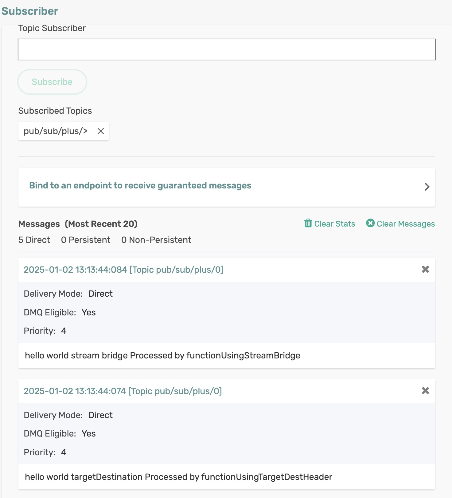

# Dynamic Producer Destinations

The Solace Spring Cloud Stream Binder supports a dynamic target destination feature, allowing message producers to send events to dynamically resolved destinations at runtime. Instead of hard-coding destinations in configuration files, you can specify them programmatically based on the message content or context.

This feature leverages Spring's flexible messaging system by using the header property in the message. You can include a solace_destination header (or a configured equivalent), and the binder will route the message to the specified destination. This is particularly useful for multi-tenant architectures or dynamic routing scenarios where destinations vary depending on business logic.


For this binder’s implementation of this header, the target destination defines the exact Solace topic or queue to which a message will be sent. i.e. No post-processing is done.

This binder also adds a reserved message header called _**solace_scst_targetDestinationType**_ (retrievable via _SolaceBinderHeaders.TARGET_DESTINATION_TYPE_), which allows to override the configured producer destination-type.


## Requirements

To run this sample, you will need to have installed:

Java 17 or Above

## Code Tour

In the DynamicDestinationProcessor application, review the processor and consumer code which presents two distinct options.

**Option 1:**

Using scst_targetDestination header. Works with any binder that supports the header, including Solace.

Note that the _BinderHeaders.TARGET_DESTINATION_ header is essentially telling the binder to override the default destination specified on a binding and if the header is NOT set then the message would be sent to the default destination.

```java
MessageBuilder.withPayload(payload)
  .setHeader(BinderHeaders.TARGET_DESTINATION, "some-dynamic-destination").build();
```

**Option 2:**

Using StreamBridge, works with any binder.

```java
streamBridge.send("some-dynamic-destination", payload);
```

This message will be sent to the ```some-dynamic-destination``` topic, ignoring the producer’s configured destination.

Optionally, the configured producer destination-type can be overridden.

For more information, checkout binder documentation on this topic [dynamic-producer-destinations](https://github.com/SolaceProducts/solace-spring-cloud/tree/master/solace-spring-cloud-starters/solace-spring-cloud-stream-starter#dynamic-producer-destinations).

## Running the application

Make sure to update the Solace Broker connection details with the appropriate host, msgVpn, client username, and password in `spring.cloud.stream.binders.solace-broker.environment` settings.

```
cd cloud-stream-dynamic-destination-processor
mvn clean spring-boot:run
```
This will start the Spring Boot application.

You can see the processor and consumer functions sets the target destination dynamically (overriding the default destination). You can receive the messages on the dynamic destination ```pub/sub/plus/[count]```, instead of the default ```topic/in/[destination]```.


<p align="center"></p>

In the terminal, you can see the target destination set dynamically.
```
2025-01-02T13:22:26.774+05:30  INFO 13158 --- [pool-3-thread-1] c.s.s.s.scs.DynamicDestinationProcessor  : Processing message: hello world targetDestination
2025-01-02T13:22:26.774+05:30  INFO 13158 --- [pool-3-thread-1] c.s.s.s.scs.DynamicDestinationProcessor  : Setting dynamic target destination to (functionUsingTargetDestHeader): pub/sub/plus/1
2025-01-02T13:22:26.774+05:30  INFO 13158 --- [pool-4-thread-1] c.s.s.s.scs.DynamicDestinationProcessor  : Processing message (functionUsingStreamBridge): hello world stream bridge
2025-01-02T13:22:26.775+05:30  INFO 13158 --- [pool-4-thread-1] c.s.s.s.scs.DynamicDestinationProcessor  : Setting dynamic target destination to (functionUsingStreamBridge): pub/sub/plus/2
2025-01-02T13:22:26.786+05:30  INFO 13158 --- [pool-5-thread-1] c.s.s.s.scs.DynamicDestinationProcessor  : receiveAll received hello world targetDestination Processed by functionUsingTargetDestHeader
2025-01-02T13:22:26.786+05:30  INFO 13158 --- [pool-4-thread-1] .s.s.c.s.b.o.JCSMPOutboundMessageHandler : Creating producer to TOPIC pub/sub/plus/2 <message handler ID: 8d0038de-33a0-4a01-b01f-b99c82bcaae4>
2025-01-02T13:22:26.787+05:30  INFO 13158 --- [pool-4-thread-1] o.s.c.s.m.DirectWithAttributesChannel    : Channel 'application.pub/sub/plus/2' has 1 subscriber(s).
2025-01-02T13:22:26.795+05:30  INFO 13158 --- [pool-5-thread-1] c.s.s.s.scs.DynamicDestinationProcessor  : receiveAll received hello world stream bridge Processed by functionUsingStreamBridge
2025-01-02T13:22:27.732+05:30  INFO 13158 --- [pool-3-thread-1] c.s.s.s.scs.DynamicDestinationProcessor  : Processing message: hello world targetDestination
2025-01-02T13:22:27.732+05:30  INFO 13158 --- [pool-3-thread-1] c.s.s.s.scs.DynamicDestinationProcessor  : Setting dynamic target destination to (functionUsingTargetDestHeader): pub/sub/plus/3
2025-01-02T13:22:27.735+05:30  INFO 13158 --- [pool-4-thread-1] c.s.s.s.scs.DynamicDestinationProcessor  : Processing message (functionUsingStreamBridge): hello world stream bridge
2025-01-02T13:22:27.735+05:30  INFO 13158 --- [pool-4-thread-1] c.s.s.s.scs.DynamicDestinationProcessor  : Setting dynamic target destination to (functionUsingStreamBridge): pub/sub/plus/4
2025-01-02T13:22:27.738+05:30  INFO 13158 --- [pool-5-thread-1] c.s.s.s.scs.DynamicDestinationProcessor  : receiveAll received hello world targetDestination Processed by functionUsingTargetDestHeader
2025-01-02T13:22:27.740+05:30  INFO 13158 --- [pool-4-thread-1] .s.s.c.s.b.o.JCSMPOutboundMessageHandler : Creating producer to TOPIC pub/sub/plus/4 <message handler ID: 9c039450-5d88-4655-bd7b-103a0aee26b1>
2025-01-02T13:22:27.740+05:30  INFO 13158 --- [pool-4-thread-1] o.s.c.s.m.DirectWithAttributesChannel    : Channel 'application.pub/sub/plus/4' has 1 subscriber(s).
2025-01-02T13:22:27.746+05:30  INFO 13158 --- [pool-5-thread-1] c.s.s.s.scs.DynamicDestinationProcessor  : receiveAll received hello world stream bridge Processed by functionUsingStreamBridge
```

For more information, checkout binder documentation on this topic [dynamic-producer-destinations](https://github.com/SolaceProducts/solace-spring-cloud/tree/master/solace-spring-cloud-starters/solace-spring-cloud-stream-starter#dynamic-producer-destinations).


🔥 Yes, Now you can dynamically set the target destination! 🔥