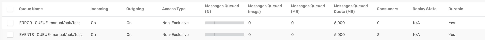
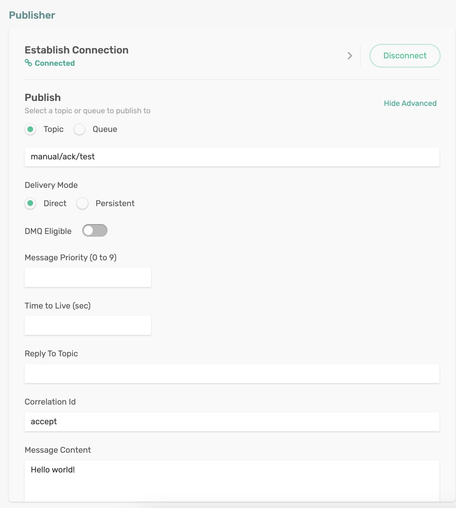
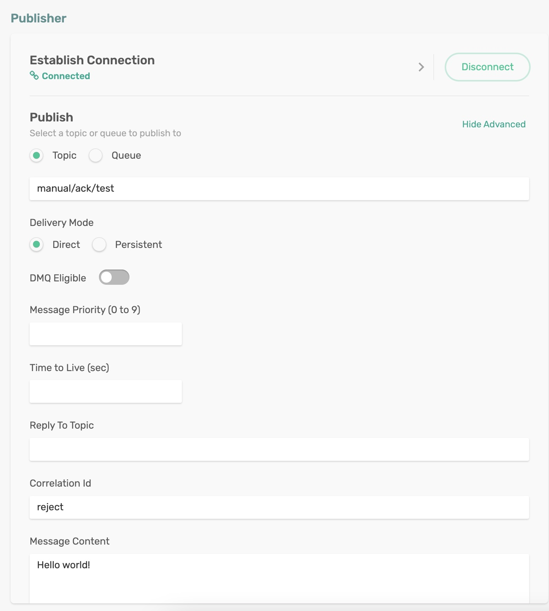
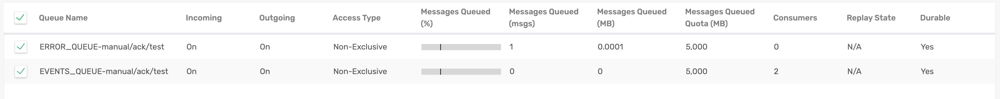
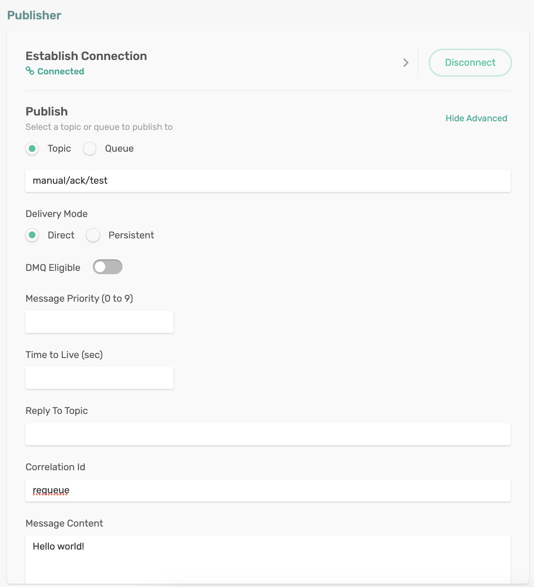
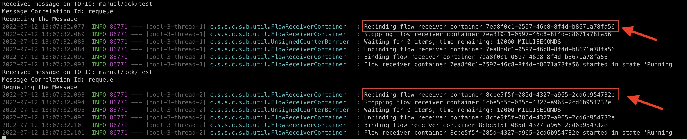
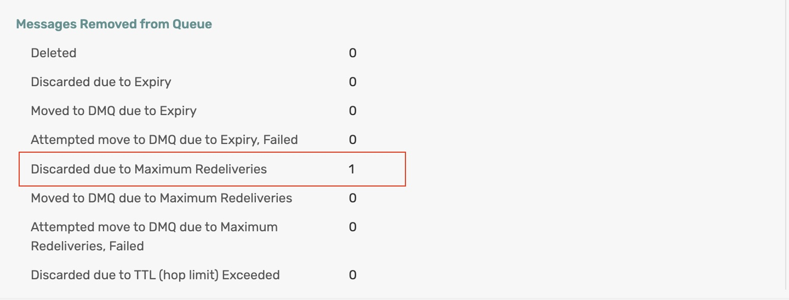

# Manual Message Acknowledgement

In general, a received message is automatically acknowledged. This is true whether the message is consumed or results in an error. To manage the acknowledgement manually, the message handlers can disable auto-acknowledgment and manually invoke the acknowledgement callback. 

However, you can take charge of the message acknowledgement process and programmatically control the outcome. This would require disabling the auto-acknowledgment and implementing an acknowledgement callback in the Consumer.


| Status  | Action                  |
|---------|-------------------------|
| ACCEPT  | Acknowledge the message |
| REJECT  | If `autoBindErrorQueue` is true, then republish the message onto the error queue and `ACCEPT` it. Otherwise, if the consumer is in a defined consumer group, invoke REQUEUE. <br/><br/>Otherwise, the consumer is in an anonymous group, and the message will be discarded. Refer to this section for more information on the [Failed Consumer Message Error Handling](https://github.com/SolaceProducts/solace-spring-cloud/tree/master/solace-spring-cloud-starters/solace-spring-cloud-stream-starter#failed-consumer-message-error-handling)|
| REQUEUE | If the consumer is in a defined consumer group, rebind the consumer flow for redelivery.<br/><br/>Otherwise, a `SolaceAcknowledgmentException` will be thrown.<br/><br/>Refer to this section for more information on [Message Redelivery](https://github.com/SolaceProducts/solace-spring-cloud/tree/master/solace-spring-cloud-starters/solace-spring-cloud-stream-starter#message-redelivery)|

To demonstrate all the acknowledgement options in action, we will work with `correlationId` which shall carry the intent of acknowledgement action. In our code, we will appropriately `ACCEPT`, `REJECT` or `REQUEUE` based on the set `correlationId` and observe the outcome.

## Requirements

To run this sample, you will need to have installed:

Java 8 or Above

## Code Tour

In the ManualAcknowledgement application, review the function code.

As a first step, let us disable the auto-acknowledgement.

```
AcknowledgmentCallback ackCallback = StaticMessageHeaderAccessor.getAcknowledgmentCallback(v);
ackCallback.noAutoAck();
```

Let us extract the `correlationId` from the message.
```
String cid = (String) v.getHeaders().get("solace_correlationId");
```

Based on the set correlationId value, we will choose appropriate acknowledgement action. 

```
if (cid.equals("accept")) {
    log.info("Accepting the Message");
    AckUtils.accept(ackCallback);
} else if (cid.equals("requeue")) {
    log.info("Requeuing the Message");
    AckUtils.requeue(ackCallback);
    Thread.sleep(30000);
} else {
    log.info("Rejecting the Message");
    AckUtils.reject(ackCallback);
    Thread.sleep(10000);
}
```

## Running the application

Make sure to update the Solace Broker connection details with appropriate host, msgVpn, client username and password in `spring.cloud.stream.binders.solace-broker.environment` settings.

```
cd manual-acknowledgement
mvn clean spring-boot:run
```
This will start the Spring Boot application.

You can see the Spring Boot application has created two queues:
1. `EVENTS_QUEUE-manual/ack/test`, a regular queue  with two consumer sessions asper our concurrency settings in the spring configuration. Having two sessions would nicely demonstrate the message redelivery on `REQUEUE` acknowledgement scenarios where the re-queued message will be delivered to the 2nd session.
   
2. `ERROR_QUEUE-manual/ack/test`, an error queue to capture `REJECTED` messages. These are messages that are explicitly rejected or maxed out the set redelivery limit.

<p align="center"></p>


### Acknowledgement mode `ACCEPT`
Publish a message on the topic `manual/ack/test` either programmatically or using the Publisher tool in the `Try Me!` utility of the Solace Broker console. 
- Enter some string (say _Hello World_) in the *Message Content*
- Click on the _Show Advanced_ option and enter `accept` as the value for `Correlation Id`
- Click on publish

<p align="center"></p>

In the terminal, you can see debug messages hinting at the manual acknowledgement - `ACCEPT` code block in action.

```
Received message on TOPIC: manual/ack/test/ACCEPT
Message Correlation Id: accept
Accepting the Message
```

### Acknowledgement mode `REJECT`
Publish a message on the topic `manual/ack/test` either programmatically or using the Publisher tool in the `Try Me!` utility of the Solace Broker console. 
- Enter some string (say _Hello World_) in the *Message Content*
- Click on the _Show Advanced_ option and enter `reject` as the value for `Correlation Id`
- Click on publish

<p align="center"></p>

In the terminal, you can see debug messages hinting at the manual acknowledgement - `REJECT` code block in action.

```
Received message on TOPIC: manual/ack/test
Message Correlation Id: reject
Rejecting the Message
2022-07-12 12:35:51.649  INFO 85228 --- [pool-3-thread-1] .s.b.u.ErrorQueueRepublishCorrelationKey : Republishing XMLMessage 1 to error queue ERROR_QUEUE-manual/ack/test - attempt 1 of 3
```

You can verify the rejected message is queued in the `` queue.

<p align="center"></p>


### Acknowledgement mode `REQUEUE`
Publish a message on the topic `manual/ack/test` either programmatically or using the Publisher tool in the `Try Me!` utility of the Solace Broker console. 
- Enter some string (say _Hello World_) in the *Message Content*
- Click on the _Show Advanced_ option and enter `requeue` as the value for `Correlation Id`
- Click on publish

<p align="center"></p>

In the terminal, you can see debug messages hinting at the manual acknowledgement - `REQUEUE` code block in action.

<p align="center"></p>

Note that the message was originally received on session `7ea8f0c1-0597-46c8-8f4d-b8671a78fa56`, since the message was acknowledged with `REQUEUE`  - the session rebinds itself (disconnect and reconnect with a delay). At this point, the message gets redelivered to the second session `8cbe5f5f-085d-4327-a965-2cd6b954732e` - and again acknowledged with `REQUEUE` status. Both the sessions has opted for `REQUEUE` and with `queueMaxMsgRedelivery: 2` the message gets discarded.

You can verify this by checking the `EVENTS_QUEUE-manual/ack/test` stats.

<p align="center"></p>

**NOTE**: If you configure a DMQ for the `EVENTS_QUEUE-manual/ack/test` and publish the messages with `DMQ Eligible` turned on, messages won't be discarded after reaching max redelivery limit - rather queued in the DMQ. As an exercise, try for yourself!

🔥 Yes, Now you can manage your acknowledgements manually suiting your business requirements! 🔥