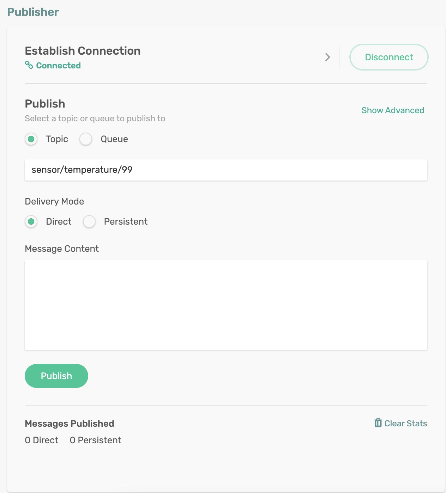
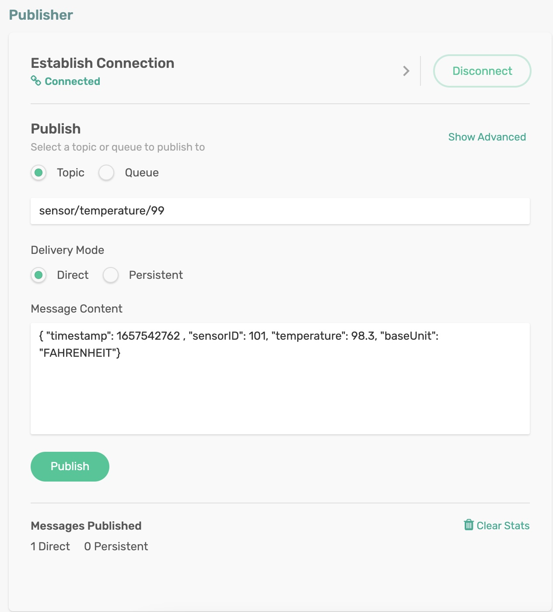

# Null Payload Handling

Spring messages can’t contain null payloads. However, an external application may push null payload messages. If unchecked, an empty message could crash the application. 

When that is the case, the binder sets the Spring message’s payload to a null equivalent. Null equivalent payloads are one of the following - empty byte[], empty String, empty SDTMap, or empty SDTStream and add `solace_scst_nullPayload` header when a Solace message with null payload is consumed from the wire.

Spring provides message transformation capability using `MessageConverter` feature. We can implement a user-defined (custom)  `MessageConverter` and inspect the incoming message for null payload by checking the `NULL_PAYLOAD` flag in the *SolaceHeader*. If found, we can either return a default or dummy POJO, which should prevent the Spring application from crashing.

## Requirements

To run this sample, you will need to have installed:

Java 8 or Above

## Code Tour

In the TemperatureSink application, we need to add the custom message converter.

```
@Bean
public MessageConverter customMessageConverter() {
    return new NullSensorReadingConverter();
}
```

In the `NullSensorReadingConverter` class, we implement the logic to check for *SolaceHeaders* and take necessary action.

```
@Override
protected Object convertFromInternal(Message<?> message, Class<?> targetClass, Object conversionHint) {
    if ((boolean) message.getHeaders().getOrDefault(SolaceBinderHeaders.NULL_PAYLOAD, false)) {
        // Debug message to hint at NULL payload
        System.out.println("Received NULL payload, returning dummy SensorReading object");
        return new SensorReading();
    } else {
        // Received a valid non-NULL payload, no further processing required
        return super.convertFromInternal(message, targetClass, conversionHint);
    }
}
```

## Running the application

Make sure to update the Solace Broker connection details with the appropriate host, msgVpn, client username, and password in `spring.cloud.stream.binders.solace-broker.environment` settings.

```
cd null-payload-converter
mvn clean spring-boot:run
```
This will start the Spring Boot application.

### Publishing a Message with NULL payload
Publish a message on the topic `sensor/temperature/99` either programmatically or using the Publisher tool in the `Try Me!` utility of the Solace Broker console. Leave the *Message Content* empty.

<p align="center"></p>

In the terminal, you can see the *SolaceHeaders.NULL_PAYLOAD* check passed, and a dummy *SensorReading* object is returned.
```
Received NULL payload, returning dummy SensorReading object
SensorReading [ 2022-07-11 21:20:57.652 null n null ]
```

### Publishing a Message with a non-NULL payload
Publish a message on the topic `sensor/temperature/99` either programmatically or using the Publisher tool in the `Try Me!` utility of the Solace Broker console. 

Populate the following string as the message content:
```
{ "timestamp": 1657542762 , "sensorID": 101, "temperature": 98.3, "baseUnit": "FAHRENHEIT"}
```

<p align="center"></p>

In the terminal, you can see the *SolaceHeaders.NULL_PAYLOAD* check passed, and a dummy *SensorReading* object is returned.
```
Received a non-NULL payload, returning the object
SensorReading [ 1970-01-20 09:55:42.762 101 98.3 FAHRENHEIT ]
```

🔥 Yes, Now you can prevent your Spring application from crashing when it receives a null payload! 🔥