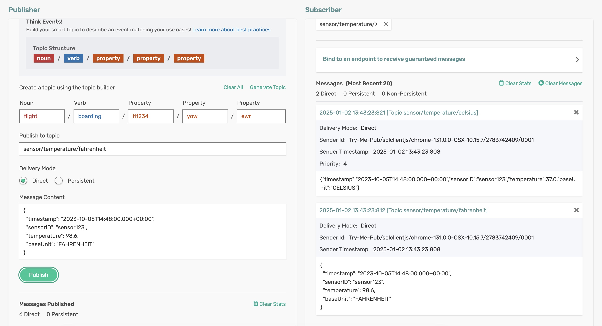

# cloud-stream-processor - Using Spring Cloud Stream Processor

The `ConvertFtoCProcessor` application is a Spring Boot application that processes incoming sensor readings (object of type *SensorReading*). It uses a Spring Cloud Stream processor function to convert the temperature value from Fahrenheit to Celsius and produces a new *SensorReading* with the temperature in Celsius.

## Requirements

To run this sample, you will need to have installed:

- Java 17 or Above

## Code Tour

In the `ConvertFtoCProcessor` application, review the processor code which converts the temperature from Fahrenheit to Celsius.

```java
@Bean
public Function<SensorReading, SensorReading> convertFtoC() {
    return reading -> {
        log.info("Received: " + reading);

        double temperatureCelsius = (reading.getTemperature().doubleValue() - 32) * 5 / 9;
        reading.setTemperature(temperatureCelsius);
        reading.setBaseUnit(SensorReading.BaseUnit.CELSIUS);

        log.info("Sending: " + reading);

        return reading;
    };
}
```

- The function receives a `SensorReading` object, converts its temperature from Fahrenheit to Celsius, and returns the modified `SensorReading` object.

## Running the application

Make sure to update the Solace Broker connection details with the appropriate host, msgVpn, client username, and password in `application.yml`.

```sh
cd cloud-stream-processor
mvn clean spring-boot:run
```
This will start the Spring Boot application.

Using Solace Try-Me UI, publish an event on the topic ```sensor/temperature/fahrenheit```, with the following payload
```json
{
  "timestamp": "2023-10-05T14:48:00.000+00:00",
  "sensorID": "sensor123",
  "temperature": 98.6,
  "baseUnit": "FAHRENHEIT"
}
```

You can see the processor function converts the temperature from Fahrenheit to Celsius and logs the received and sent sensor readings.

<p align="center"></p>

In the terminal, you can see the received and sent sensor readings.
```
2025-01-02T13:43:23.816+05:30  INFO 14149 --- [pool-5-thread-1] c.s.s.spring.scs.ConvertFtoCProcessor    : Received: SensorReading [ 2023-10-05 20:18:00.0 sensor123 98.6 FAHRENHEIT ]
2025-01-02T13:43:23.816+05:30  INFO 14149 --- [pool-5-thread-1] c.s.s.spring.scs.ConvertFtoCProcessor    : Sending: SensorReading [ 2023-10-05 20:18:00.0 sensor123 37.0 CELSIUS ]
```

🚀 Leverage the power of Spring Cloud Stream to build robust and scalable data processing pipelines with ease! 🚀