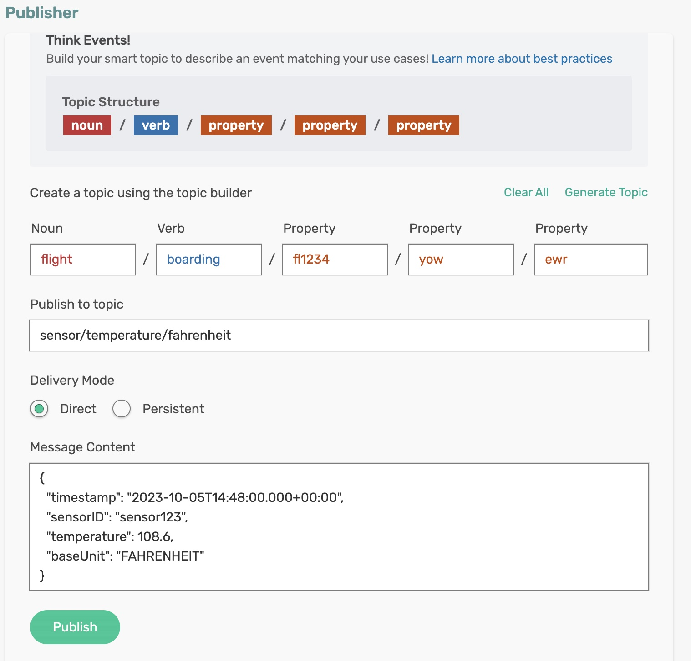
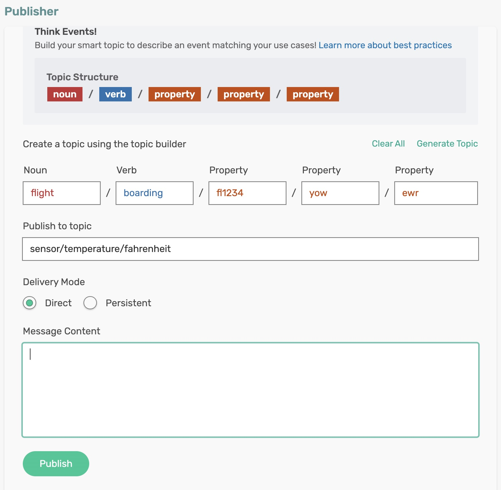

# cloud-stream-sink-null-payload-converter - Using Spring Cloud Stream Supplier

The `TemperatureSink` application is a Spring Boot application that leverages Spring Cloud Stream to consume sensor readings (objects of type `SensorReading`) from a message broker. It utilizes a registered MessageConverter to handle ```null``` payloads so that the consumer does not crash when trying to access the payload data.

## Empty Payload VS Null Payload
Spring messages can’t contain null payloads, however, message handlers can differentiate between null payloads and empty payloads by looking at the ```solace_scst_nullPayload``` header. The binder adds the ```solace_scst_nullPayload``` header when a Solace message with null payload is consumed from the wire. When that is the case, the binder sets the Spring message’s payload to a null equivalent payload. Null equivalent payloads are one of the following: empty byte[], empty String, empty SDTMap, or empty SDTStream.

For more information, checkout the binder documentation on this topic [Empty Payload VS Null Payload](https://github.com/SolaceProducts/solace-spring-cloud/tree/master/solace-spring-cloud-starters/solace-spring-cloud-stream-starter#empty-payload-vs-null-payload)

## Requirements

To run this sample, you will need to have installed:

- Java 17 or Above

## Code Tour

In the `TemperatureSink` application, review the source code which consumes sensor readings published on the broker and simply prints the message content on the console.

```java
@Bean
public Consumer<SensorReading> sink(){
  return System.out::println;
}
```

You can also see that the `TemperatureSink` application defines and registers a ```MessageConverter```.

```java
@Bean
public MessageConverter customMessageConverter() {
  return new NullSensorReadingConverter();
}
```

Review the ```NullSensorReadingConverter.java```. You can see that the class ```NullSensorReadingConverter``` extends spring cloud stream's ```AbstractMessageConverter``` class and overrides the method ```convertFromInternal```. 

```java
@Override
protected Object convertFromInternal(Message<?> message, Class<?> targetClass, Object conversionHint) {
  /*
    * NOTE: If the payload is null, then the "solace_scst_nullPayload" message header will be set to true. 
    * Because the Spring framework does not allow for a message to have a null payload we need to 
    * add a custom message converter to handle that scenario to return a message with either a 
    * default or custom payload. 
    */
  
  if ((boolean) message.getHeaders().getOrDefault(SolaceBinderHeaders.NULL_PAYLOAD, false)) {
    return new SensorReading();
  } else {
    return super.convertFromInternal(message, targetClass, conversionHint);
  }
}
```

The ```convertFromInternal``` function simply checks whether the payload is null by checking the message header as set by the solace binder: *SolaceBinderHeaders.NULL_PAYLOAD*. If the header is set (i.e., the message contains a ```null``` payload), then return a empty ```SensorReading``` object - otherwise, return the output from the default converter (i.e., a non-null, valid payload).

## Running the application

Make sure to update the Solace Broker connection details with the appropriate host, msgVpn, client username, and password in `application.yml`.

```sh
cd cloud-stream-sink-null-payload-converter
mvn clean spring-boot:run
```

This will start the Spring Boot application and create a queue with subscription to topic ```sensor/temperature/>``` and waits for messages to arrive.

### Receiving a Valid Payload

Using Solace Try-Me UI, publish an event on the topic ```sensor/temperature/fahrenheit```, with the following payload
```json
{
  "timestamp": "2023-10-05T14:48:00.000+00:00",
  "sensorID": "sensor123",
  "temperature": 98.6,
  "baseUnit": "FAHRENHEIT"
}
```
<p align="center"></p>

In the terminal, you can see the message is received, and the payload content is printed in the console.

```
SensorReading [ 2023-10-05 20:18:00.0 sensor123 98.6 FAHRENHEIT ]
SensorReading [ 2023-10-05 20:18:00.0 sensor123 108.6 FAHRENHEIT ]
```

### Receiving a Null Payload

Now, empty the message content text area of the publisher in the Solace Try-Me UI and publish the message. 

```
NOTE: This is equivalent to publishing the message with a null payload.
```

<p align="center"></p>

In the terminal, you will see a converted payload with null values for the fields of ```SensorReading``` object.

```log
SensorReading [ 2025-01-02 14:47:45.289 null n null ]
SensorReading [ 2025-01-02 14:47:53.709 null n null ]
```


Instead of a ```null``` value for the payload, the *MessageConverter* function constructed an _empty_ (dummy) object. You can see that the converter function uses the empty constructor of the ```SensorReading``` class which returns an object a valid timestamp for the ```timetimestamp``` attribute and ```null``` value for other attributes. In essence, it is a valid object but with ```null``` values for the attributes. This distinction could help to handle ```null``` payload scenarios at the application level, and can be customized to have a representation suiting the needs.

```java
public SensorReading() {
  timestamp = new Timestamp(System.currentTimeMillis());
}
```

🚀 Leverage the power of Spring Cloud Stream to build robust and scalable data production pipelines with ease! 🚀

