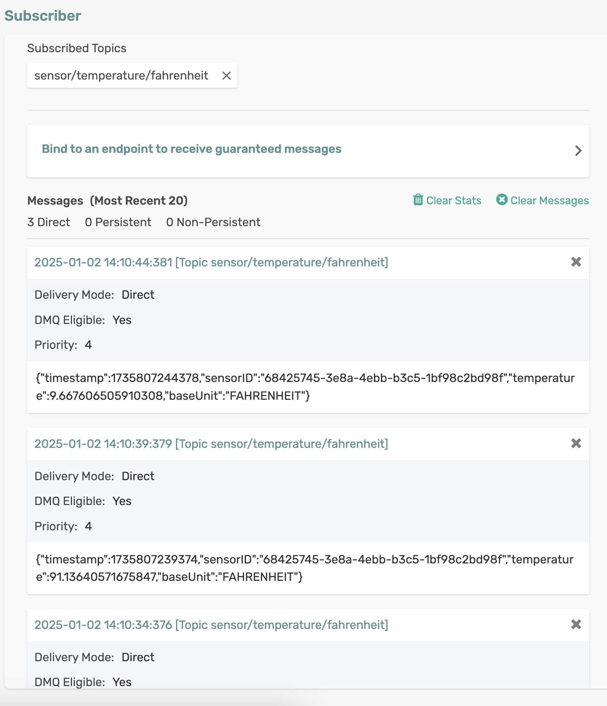

# cloud-stream-source - Using Spring Cloud Stream Supplier

The `FahrenheitTempSource` application is a Spring Boot application that leverages Spring Cloud Stream to produce sensor readings (objects of type `SensorReading`) to a message broker.

## Requirements

To run this sample, you will need to have installed:

- Java 17 or Above

## Code Tour

In the `FahrenheitTempSource` application, review the source code which generates and sends sensor readings.

```java
@Bean
public Supplier<SensorReading> emitSensorReading() {
  return () -> {
    double temperature = random.nextDouble() * RANDOM_MULTIPLIER;

    SensorReading reading = new SensorReading();
    reading.setSensorID(sensorIdentifier.toString());
    reading.setTemperature(temperature);
    reading.setBaseUnit(BaseUnit.FAHRENHEIT);

    log.info("Emitting " + reading);

    return reading;
  };
}
```


The function generates a *SensorReading* object and logs the sent sensor reading.

## Running the application

Make sure to update the Solace Broker connection details with the appropriate host, msgVpn, client username, and password in `application.yml`.

```sh
cd cloud-stream-source
mvn clean spring-boot:run
```

This will start the Spring Boot application.

You can see the source function generates and sends sensor readings as received by a subscriber via Solace Try-Me UI.

<p align="center"></p>

In the terminal, you can see the sent sensor readings.

```
2025-01-02T14:10:34.252+05:30  INFO 15691 --- [   scheduling-1] c.s.s.spring.scs.FahrenheitTempSource    : Emitting SensorReading [ 2025-01-02 14:10:34.245 68425745-3e8a-4ebb-b3c5-1bf98c2bd98f 74.8 FAHRENHEIT ]
2025-01-02T14:10:39.374+05:30  INFO 15691 --- [   scheduling-1] c.s.s.spring.scs.FahrenheitTempSource    : Emitting SensorReading [ 2025-01-02 14:10:39.374 68425745-3e8a-4ebb-b3c5-1bf98c2bd98f 91.1 FAHRENHEIT ]
2025-01-02T14:10:44.378+05:30  INFO 15691 --- [   scheduling-1] c.s.s.spring.scs.FahrenheitTempSource    : Emitting SensorReading [ 2025-01-02 14:10:44.378 68425745-3e8a-4ebb-b3c5-1bf98c2bd98f 9.7 FAHRENHEIT ]
```

🚀 Leverage the power of Spring Cloud Stream to build robust and scalable data production pipelines with ease! 🚀

