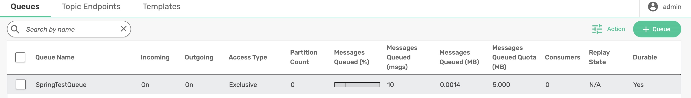

# spring-boot-autoconfig-sender

The `SpringBootSender` application is a Spring Boot application that demonstrates how to send messages to a JMS queue using Spring's `JmsTemplate`. This application is configured to send a message to a specified queue at a fixed interval.

## Intent and Purpose

The purpose of this application is to showcase how to:
- Configure a Spring Boot application to send messages to a JMS queue.
- Use `JmsTemplate` for sending messages.
- Schedule message sending at fixed intervals using Spring's scheduling support.

## Code Overview

### Main Class

The main class `SpringBootSender` is annotated with `@SpringBootApplication` and `@EnableScheduling` to enable Spring Boot's auto-configuration and scheduling support.

```java
@SpringBootApplication
@EnableScheduling
public class SpringBootSender {
    public static void main(String[] args) {
        SpringApplication.run(SpringBootSender.class, args);
    }
}
```

### Configure JMS Queue with a Value
```java
@Value("SpringTestQueue")
private String queueName;
```

### Sending Messages
The application sends a message to the specified queue (SpringTestQueue) every 5 seconds.

```java
@Scheduled(fixedRate = 5000)
public void sendEvent() throws Exception {
    String msg = "Hello World " + System.currentTimeMillis();
    System.out.println("==========SENDING MESSAGE========== " + msg);
    jmsTemplate.convertAndSend(queueName, msg);
}
```

### Running the Application

Do create a queue by name ```SpringTestQueue``` on the broker before running the application.

To run the application, use the following command:

```log
mvn clean spring-boot:run
```

This will start the Spring Boot application and you will see messages being sent to the queue at regular intervals in the console output.

On the console, you can see the messages being published:
```log
==========SENDING MESSAGE========== Hello World 1735811286313
==========SENDING MESSAGE========== Hello World 1735811291313
==========SENDING MESSAGE========== Hello World 1735811296313
==========SENDING MESSAGE========== Hello World 1735811301313
==========SENDING MESSAGE========== Hello World 1735811306313
==========SENDING MESSAGE========== Hello World 1735811311313
==========SENDING MESSAGE========== Hello World 1735811316313
==========SENDING MESSAGE========== Hello World 1735811321313
==========SENDING MESSAGE========== Hello World 1735811326313
```

On the broker, you should be able to see the queued messages.

<p align="center"></p>


## Conclusion
This application demonstrates how to use Spring Boot and JmsTemplate to send messages to a JMS queue at fixed intervals. It highlights the configuration of the JmsTemplate and the use of Spring's scheduling support to automate message sending.
